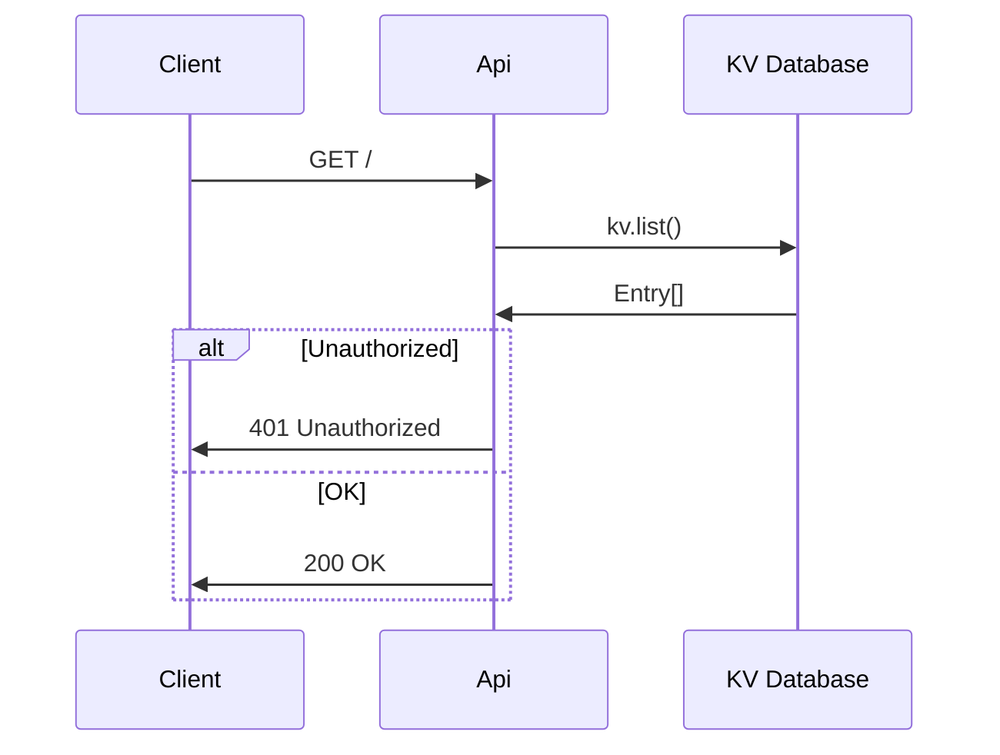

# Feedback API

Simple API to manage feedback form submissions hosted on Deno deploy.

## GET /



## POST /

```mermaid
sequenceDiagram
    participant Client
    participant Api
    participant Db as KV Database
    participant Resend
    Client->>Api: GET /
    Api->>Db: kv.set()
    Db->>Api: Entry
    Api->>Resend: resend.emails.send()
    alt Error
        Resend->>Api: 400 Error
    else OK
        Resend->>Api: 200 OK
    end
    alt Unauthorized
        Api->>Client: 401 Unauthorized
    else Error
        Api->>Client: 400 Error
    else OK
        Api->>Client: 200 OK
    end```

## DELETE /

```mermaid
sequenceDiagram
    participant Client
    participant Api
    participant Db as KV Database
    Client->>Api: GET /
    Api->>Db: kv.delete()
    Db->>Api: Entry
    alt Unauthorized
        Api->>Client: 401 Unauthorized
    else OK
        Api->>Client: 200 OK
    end
```
